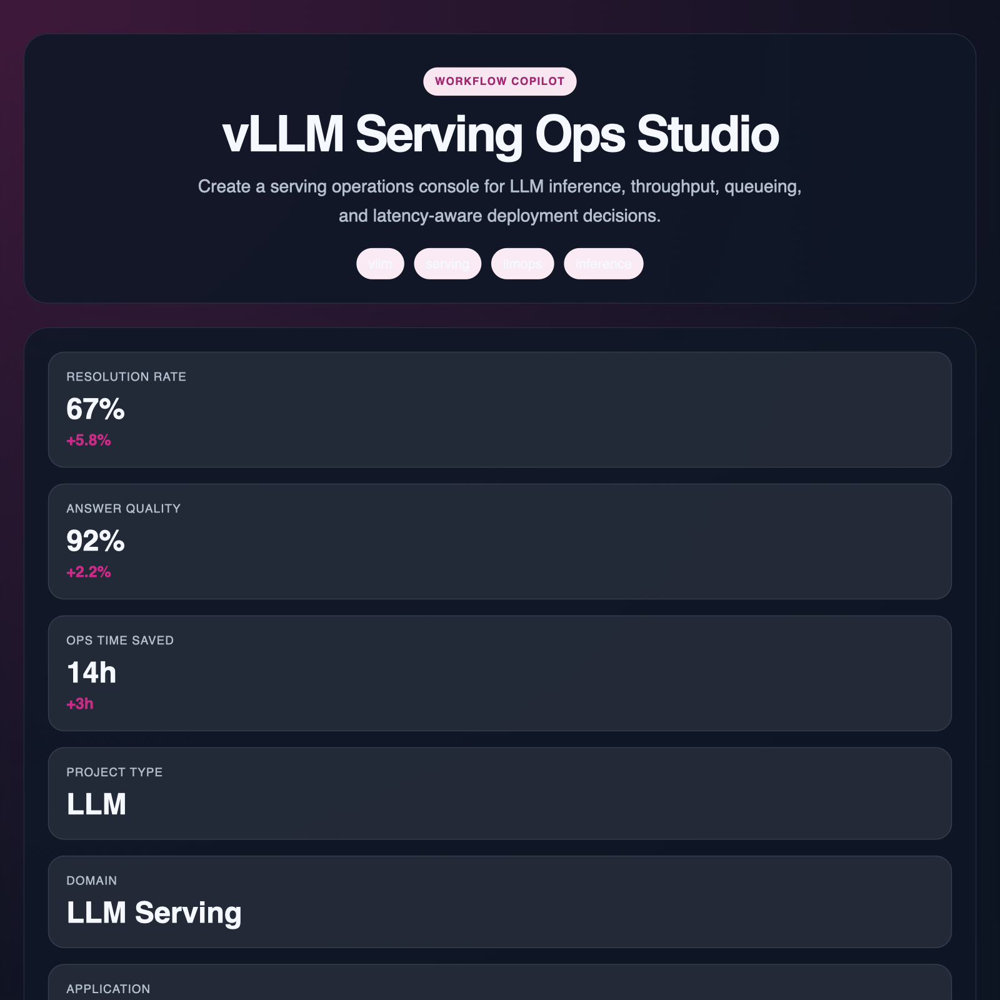

# vLLM Serving Ops Studio



## What this repo now includes

- Production-style `FastAPI` application scaffold
- API endpoints for manifest, readiness, and showcase signals
- 3D immersive static landing page in `docs/` for GitHub Pages
- Docker packaging, Compose file, smoke test, and CI workflow

## Primary audience

operations lead

## Domain

Applied AI product systems

## Run locally

```bash
pip install -r requirements.txt
uvicorn src.app.main:app --reload
```

## Surfaces

- App: `src/app/main.py`
- Landing page: `docs/index.html`
- GitHub Pages target: `https://r-behera.github.io/vllm-serving-ops-studio/`

## Production notes

See `docs/deployment.md` for a simple deployment path and GitHub Pages guidance.
